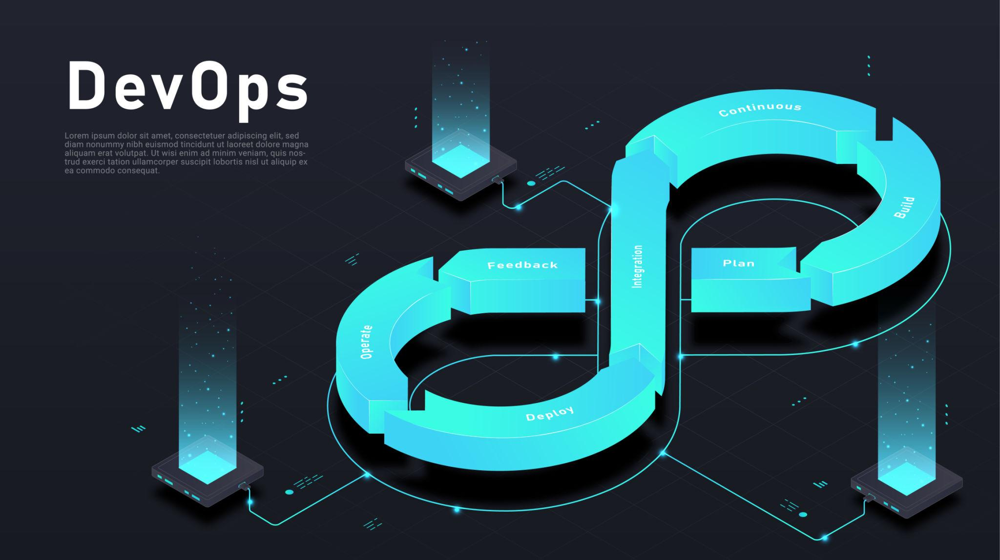

<h1 align="center">🚀 DevOps Roadmap</h1>

<p align="center">
A complete roadmap to become a DevOps Engineer from beginner to advanced.
</p>
<p align="center">
  
</p>

<p align="center">


</p>

---

## 📚 Learning Path

```text
🐧 Linux
      ↓
🌿 Git & GitHub
      ↓
🐍 Python
      ↓
🐳 Docker
      ↓
☸️ Kubernetes
      ↓
⛵ Helm
      ↓
⚙️ CI/CD
      ↓
🏗️ System Design
      ↓
🚀 Advanced Topics
```

---

A complete roadmap to become a DevOps Engineer from beginner to advanced.
---

# 🐧 Phase 1 — Linux

| Section | Content |
|---------|---------|
| **Level** | Beginner |
| **Learn** | Linux Basics, File System, Users & Permissions, Process Management, Networking Commands, Shell Scripting |
| **Resources** | Full playlist : <https://www.youtube.com/watch?v=oD5Y4Gzr6vw&list=PLy1Fx2HfcmWBpD_PI4AQpjeDK5-5q6TG7><br>Crash course : <https://www.youtube.com/watch?v=WMy3OzvBWc0> |
| **Practice** | Build a Linux lab using WSL or VirtualBox, create Bash scripts, learn SSH, cron jobs, permissions, and package managers. |

---

# 🌿 Phase 2 — Git & GitHub

| Section | Content |
|---------|---------|
| **Level** | Beginner |
| **Learn** | Git Basics, Branching, Merge vs Rebase, Pull Requests, GitHub Workflow, Git Tags, GitHub Actions (Introduction)              |
| **Resources** | <https://www.youtube.com/watch?v=BOjHTIQTt80> |
| **Practice** | Create repositories, open pull requests, resolve merge conflicts, and work with branches. |

---

# 🐍 Phase 3 — Python

| Section | Content |
|---------|---------|
| **Level** | Beginner |
| **Learn** | Variables, Functions, OOP, File Handling, APIs, JSON, Automation Scripts                                                   |
| **Resources** | <https://www.youtube.com/watch?v=nLRL_NcnK-4> |
| **Practice** | Build a log parser, file organizer, API automation script, and backup script. |

---

# 🐳 Phase 4 — Docker

| Section | Content |
|---------|---------|
| **Level** | Beginner → Intermediate |
| **Learn** | Images, Containers, Volumes, Networks, Dockerfile, Docker Compose, Docker Registry |
| **Resources** | <https://www.youtube.com/watch?v=DFyPl2cZM2g&list=PLX1bW_GeBRhDkTf_jbdvBbkHs2LCWVeXZ&index=1>                           |
| **Practice** | Dockerize Python and Node.js apps, create multi-stage builds, push images to Docker Hub. |

---

# ☸️ Phase 5 — Kubernetes

| Section | Content |
|---------|---------|
| **Level** | Intermediate |
| **Learn** | Pods, ReplicaSets, Deployments, Services, ConfigMaps, Secrets, Volumes, Ingress, Namespaces                                  |
| **Resources** | <https://www.youtube.com/watch?v=jTggu1HiKyY&list=PLX1bW_GeBRhDCHijCrMO5F-oHg52rRBpl> |
| **Practice** | Deploy Nginx and Flask applications, perform rolling updates, configure autoscaling. |

---

# ⛵ Phase 6 — Helm

| Section | Content |
|---------|---------|
| **Level** | Intermediate |
| **Learn** | Charts, Values, Templates, Releases, Dependencies |
| **Resources** | Youtube : <https://www.youtube.com/watch?v=x77NzZxj670&list=PLSwo-wAGP1b8svO5fbAr7ko2Buz6GuH1g&index=1><br>Notion Document : <https://app.notion.com/p/Helm-35f310f8d1ad80b0a962ef47a9059fb6?source=copy_link>                                                          |
| **Practice** | Package and deploy Kubernetes applications using Helm. |

---

# ⚙️ Phase 7 — Pipelines

| Section | Content |
|---------|---------|
| **Level** | Intermediate |
| **Learn** | Pipelines, Runners, Jobs, Stages, Variables, Deployments                                                                     |
| **Resources** | GtiHub Actions : <https://youtu.be/7gJFHjXscr8?si=LEaIeFfy0vycwUr8>|
| **Practice** | Create build, test, Docker, and Kubernetes deployment pipelines. |

---

# 🏗️ Phase 8 — System Design

| Section | Content |
|---------|---------|
| **Level** | Intermediate |
| **Learn** | Scalability, Load Balancers, Databases, Caching, Message Queues, CAP Theorem, Distributed Systems                              |
| **Resources** | repo : <https://github.com/karanpratapsingh/system-design> |
| **Practice** | Design a URL Shortener, Chat Application, and File Storage System. |

---

# 🚧 Advanced Topics (TBD)

| Topic | Status |
|-------|--------|
| Apache Kafka | ⏳                                                                                                                        |
| PostgreSQL | ⏳  |
| Patroni PostgreSQL HA | ⏳  |
| Keycloak | ⏳  |
| Elasticsearch | ⏳  |
| Observability & Monitoring | ⏳  |
